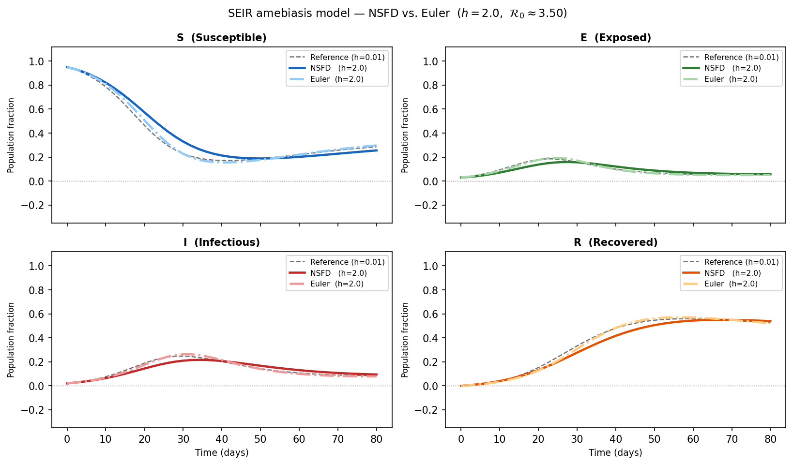
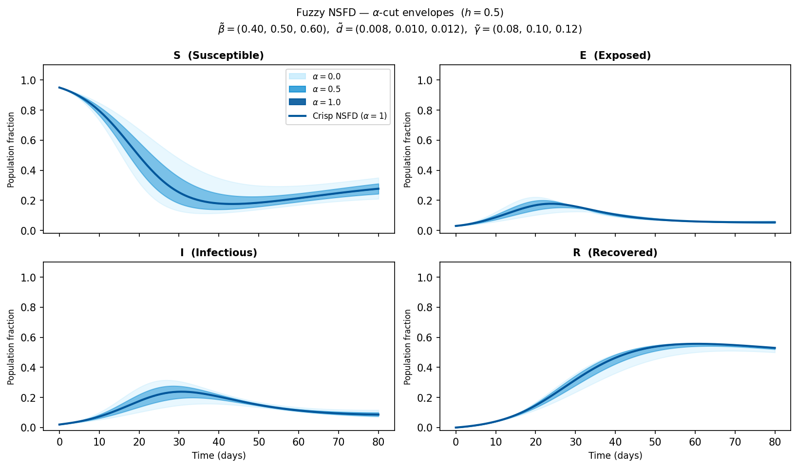

# Nonstandard Finite Difference Schemes for Uncertain Epidemic Dynamics: From Fuzzy ODEs to AI-Enhanced Discretisation

**Paper submitted to:** *Procedia Computer Science* (Elsevier)  
**Conference:** International Workshop on AI & Mathematical Methods for Real-world Impact (AI2M4RI), August 18–20, 2026, Athens, Greece

---

## Abstract

This paper presents a systematic literature review on numerical and analytical methods for solving fuzzy ordinary differential equations (FODEs), with a focus on nonstandard finite difference (NSFD) schemes and their perspectives for AI integration. A proof of concept is developed on the SEIR amebiasis model, verified against Mickens' Rule 2 and simulated numerically in both crisp and fuzzy settings. The paper further identifies four AI-driven research directions: AI-assisted construction of denominator functions, Physics-Informed Neural Networks for fuzzy dynamics, Bayesian parameter identification, and Neural ODEs with NSFD discretisation.

---

## Repository Structure

```
.
├── simulate_SEIR_NSFD.py            # Python simulation script (NSFD vs Euler)
├── AI2M4RI_PROCS_Template/
│   ├── Prisma fuzzy study.png       # PRISMA flow chart (Section 2)
│   ├── seir_deterministic.pdf       # Figure 2: Crisp NSFD vs Euler (h = 2.0)
│   ├── seir_deterministic.png
│   ├── seir_fuzzy.pdf               # Figure 3: Fuzzy alpha-cut envelopes
│   └── seir_fuzzy.png
└── references.bib                   # BibTeX bibliography
```

---

## SEIR Simulation

The script `simulate_SEIR_NSFD.py` reproduces the numerical experiments of Section 3.6.  
It implements two schemes on the SEIR amebiasis model from Alqarni et al. (2023):

| Compartment | NSFD update rule |
|-------------|-----------------|
| S | $S^{n+1} = \dfrac{S^n + h\Lambda}{1 + h\beta(\omega)I^n + h\mu}$ |
| E | $E^{n+1} = \dfrac{E^n + h\beta(\omega)S^{n+1}I^n}{1 + h(\mu+\varepsilon)}$ |
| I | $I^{n+1} = \dfrac{I^n + h\varepsilon E^{n+1}}{1 + h(\mu + d(\omega) + \gamma(\omega))}$ |
| R | $R^{n+1} = \dfrac{R^n + h\gamma(\omega)I^{n+1}}{1 + h\mu}$ |

### Parameter values (Alqarni et al. 2023)

| Parameter | Description | Crisp value | Fuzzy (triangular) |
|-----------|-------------|-------------|-------------------|
| $\Lambda$ | Recruitment rate | 0.02 | not fuzzy |
| $\mu$ | Natural death rate | 0.02 | not fuzzy |
| $\varepsilon$ | Progression rate E to I | 0.20 | not fuzzy |
| $\beta$ | Transmission rate | 0.50 | (0.40, 0.50, 0.60) |
| $d$ | Disease-induced death | 0.01 | (0.008, 0.010, 0.012) |
| $\gamma$ | Recovery rate | 0.10 | (0.080, 0.100, 0.120) |

Basic reproduction number: $\mathcal{R}_0 \approx 3.50$ (endemic equilibrium).

### Requirements

```bash
pip install numpy matplotlib
```

### Run

```bash
python simulate_SEIR_NSFD.py
```

Output figures are saved in `AI2M4RI_PROCS_Template/`.

---

## Simulation Results

### Crisp case: NSFD vs. Standard Euler (h = 2.0)



> The NSFD scheme (solid lines) preserves positivity and converges to the endemic equilibrium for all h > 0. The standard Euler method (dash-dot lines) produces biologically inadmissible negative values in compartment I. The dashed black line is the reference solution (h = 0.01).

### Fuzzy case: alpha-cut uncertainty envelopes (h = 0.5)



> Shaded bands represent the uncertainty propagated through the SEIR dynamics at alpha-levels 0, 0.5, and 1. Wider bands correspond to alpha = 0 (maximum uncertainty); the crisp trajectory is recovered at alpha = 1.

---

## Key Findings

- NSFD schemes unconditionally preserve **positivity**, **boundedness**, and **equilibrium stability** for any step size $h > 0$, which classical methods (Euler, Runge-Kutta) do not guarantee.
- The crisp simulation confirms that the NSFD scheme remains biologically valid at $h = 2.0$, while the standard Euler method produces negative population values.
- The fuzzy simulation provides alpha-cut uncertainty envelopes that propagate parameter imprecision through the epidemic dynamics, enabling more robust public health decision-making.
- Four AI-driven directions are identified as high-potential future research: symbolic regression for automated denominator-function design, PINNs, Bayesian parameter identification, and Neural ODEs with NSFD discretisation.

---

## Authors

| Author | Affiliation |
|--------|-------------|
| Dany N. Kasongo | Basic Sciences Dept., Université Nouveaux Horizons, Lubumbashi, DRC |
| Selain K. Kasereka | Technical University of Sofia, Bulgaria; ABIL Research Center & University of Kinshasa, DRC |
| Godwill W.K. Ilunga | Université Nouveaux Horizons, Lubumbashi, DRC; University of Padova, Italy |
| Dauphin K.W. Kamwanga | Basic Sciences Dept., Université Nouveaux Horizons, Lubumbashi, DRC |

---

## Citation

If you use this work or the simulation code, please cite:

```bibtex
@article{kasongo2026fuzzy,
  author    = {Kasongo, Dany N. and Kasereka, Selain K. and Ilunga, Godwill W.K. and Kamwanga, Dauphin K.W.},
  title     = {Numerical Methods for Fuzzy Ordinary Differential Equations: A Systematic Review
               with Perspectives on Nonstandard Finite Difference Schemes},
  journal   = {Procedia Computer Science},
  year      = {2026},
  note      = {AI2M4RI Workshop, Athens, Greece, August 18--20, 2026}
}
```

---

## License

This repository contains the source material for an academic paper submitted to Elsevier Procedia Computer Science. The simulation code (`simulate_SEIR_NSFD.py`) is released under the MIT License. The LaTeX manuscript remains under the authors' copyright pending journal assignment.
